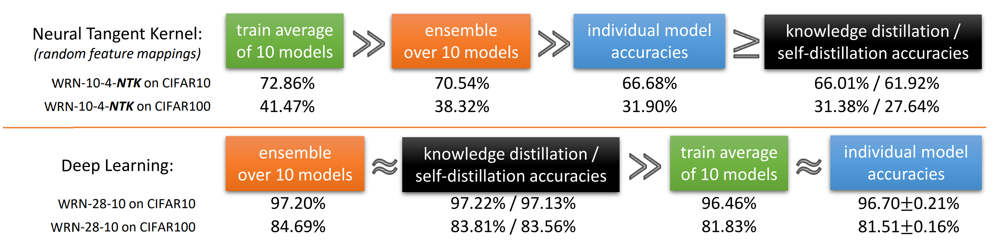
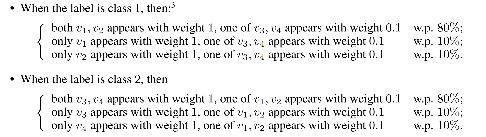
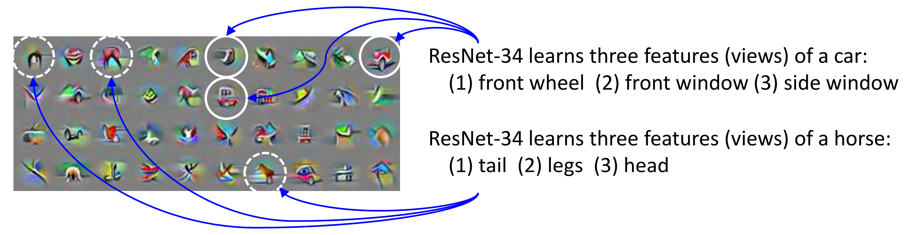
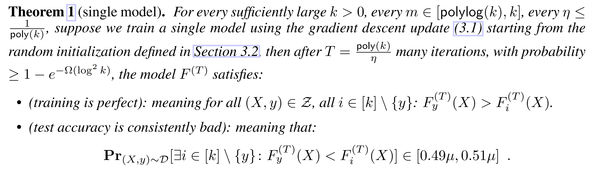
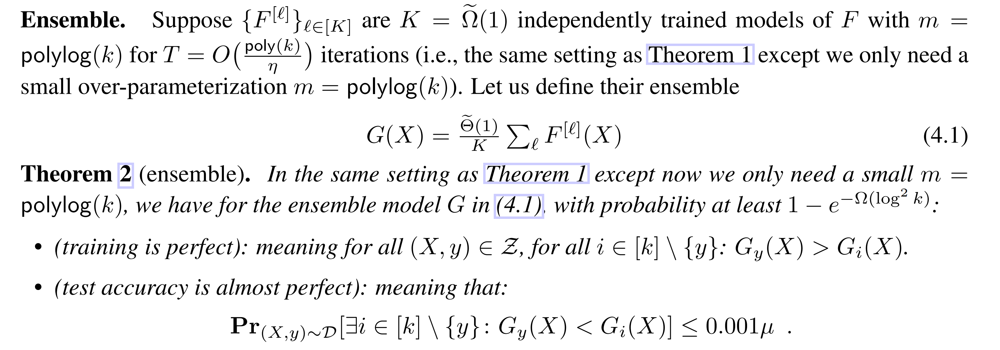
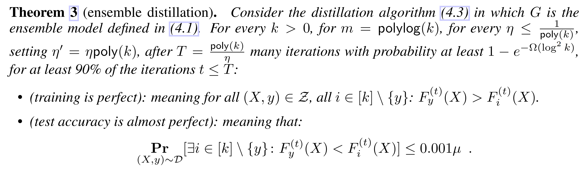
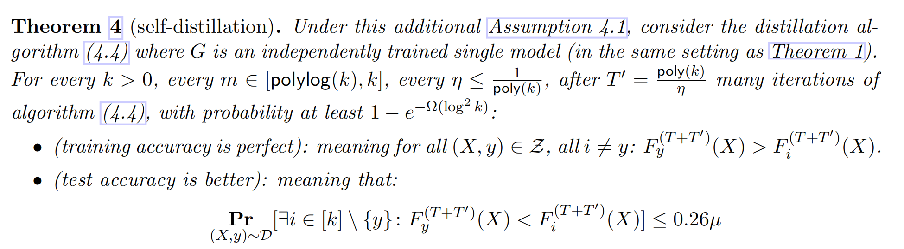
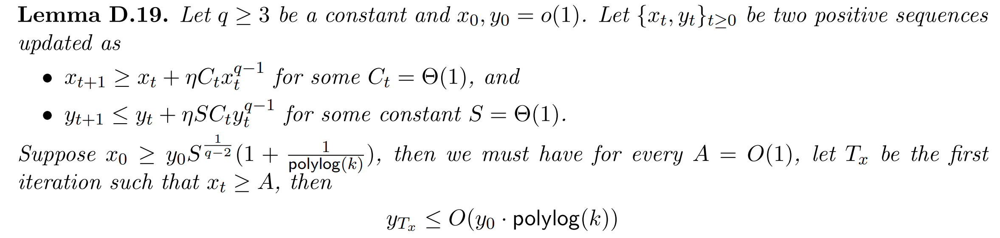

文章链接: https://openreview.net/forum?id=Uuf2q9TfXGA

arxiv链接 (full version)：https://arxiv.org/abs/2012.09816

本文是ICLR2023 的 Outstanding Paper Honorable Mentions, 作者为Zeyuan Allen-Zhu老师和Yuanzhi Li老师；其于20年就公布在arxiv上.这篇文章对于深度学习中集成学习，知识蒸馏和自蒸馏方法进行了分析，并通过引入数据的多视角假设阐述了他们有效的原因。

<h3 data-toc-skip>引言</h3>
在深度学习中,采用多个不同初始化的相同模型进行集成是一个常见的提升性能的方法. Hinton等人[1]于15年发现把多个模型的集成可以通过知识蒸馏迁移到单一模型中，同样可以达到比单一模型更好的结果。
在深度学习中，会存在以下三个现象：

1. 平均训练(Training average)不起作用: 在这里指的是采用平均的方式来融合得到输出，并联合地训练多个子网络。这样进行融合会使得表现不如集成的结果。
2. 知识蒸馏(Knowledge Distiallation)有效: 这里考虑到将多个模型集成的结果蒸馏到单一模型中。这样仍然可以使模型保持更好的表现。
3. 自蒸馏(Self-Distiallation) 有效: 即使把单一模型蒸馏到另一个模型，也会产生表现上的提升。
   
注意到这里讨论的集成中单一模型结构相同，仅有初始化的差异；并在相同训练数据上进行训练，并采用SGD方法进行优化。
对于这个问题，过去的解释认为集成可以增大随机特征映射(Random feature mapping, 这里指基于NTK的方法)的特征空间，但是其结论难以直接扩展到深度学习中。
为了充分说明之前的理论结果难以扩展，在下图中作者给出了在Neural Tangent Kernel (NTK)和深度学习中进行平均训练、集成和蒸馏得到的实验结果。可以发现，二者在平均训练和知识蒸馏的结果中均会存在一定的差异，与过去的理论相悖：即在深度学习中集成未必增大了特征空间；其是在网络表达能力范围内找到了一个更优解 (因为可以被蒸馏到同一个模型中)。

图1: 这里展示了NTK和传统深度学习在集成，蒸馏和平均训练中的不同。

基于这样的发现，这篇文章考虑在深度学习中讨论集成学习和蒸馏的泛化性问题：即当相同架构的单一模型训练准确率达到100%后，为何集成仍然能提高测试准确率？为何将该集成模型蒸馏到单一模型后仍然可以表现良好？(一个很自然的想法就是深度网络会有多个局部最优解或驻点；而单一模型训练难以找到较好的最优解)

在这里，作者引入了数据中的多视角架构的设定：即每个数据由多个视角共同决定；比如车窗和轮子是车这个物体的不同视角。当数据具有多个视角时，单一模型可能只能学习到某个视角的信息(具体学到哪个视角取决于初始化)，而其他视角在竞争中处于劣势，难以被很好的学习(类似于彩票假说)；而当采用多个模型集成时，多个视角的模式更容易被不同初始化的单一模型学习到，所以模型可以有更好的泛化性能。

图2: 多视角的数据

除此外，作者还给出了一些实验结果，说明标签噪声以及优化中的非凸驻点导致的方差和集成学习的更好表现无关。这一部分的内容在full version的附录里面有所体现。
<h3 data-toc-skip>Intuition</h3>
在这一部分，作者对于其设定进行了讨论，阐述了这篇文章为什么要在深度学习，而非随机特征(NTK)中，采用multi-view数据进行研究。

<h4 data-toc-skip>随机特征映射的问题</h4>
NTK方法具有比较好的可解释性，其希望用一阶梯度的信息来对目标进行近似，即:

$$f(W, x) \approx f(W_0, x) + \left\langle W-W_0, \nabla_W f(W_0, x) \right \rangle$$

其中$W_0$是随机初始化的权重，而$W$对应的神经网络$f(W, x)$是我们希望学习到的。当考虑网络无限宽时，通常认为每个参数仅需微小变动即可拟合训练数据，得到所需的分类器。所以，在这种考量下，这个一阶项 $\nabla_W f(W_0, x)$ 可以看作是随机特征，将其经过一个线性分类可以拟合给定的神经网络 $f(W, x)$。

纵使该种方法具有很好的理论解释性，其在集成学习的解释中会有一些问题，这里考虑上图所述实验结果，有一些矛盾如下：
1. 平均训练反而会更好:对于NTK特征集成学习或平均训练都可以获得比单一模型更好的结果。
2. 知识蒸馏并不有效: 这说明NTK在集成中进行的特征选择并不包含在任何单一模型的特征，即其扩大了表征空间。这与传统深度学习的集成结果不同。
   
基于此可以引出如下问题：
为什么当训练模型来匹配真实的数据标签时，单个模型难以充分学习这些特征呢？与原先的硬标签相比，在模型集成中探索出的隐藏的未知知识(dark knowledge)是什么？

<h4 data-toc-skip>数据中的多视角架构</h4>

过去的文章说明，当数据分布比较简单，比如高斯分布(even mixture Gaussian)时，集成并不能提高测试准确率。像这样简单分布的数据并不能说明真实世界中的实验结果。同时，过去的集成方法更多讨论减小不同单一分类器的variance，但对于泛化性而言不是必要的。所以，作者希望去设计一种setting来近似现实场景下的深度学习，即multi-view架构。

这里，考虑二分类的情况，作者给出了数据的假设如下: $v_1, v_2$ 是关于第一个类别，不同视角(view)的特征, 而$v_3, v_4$ 是关于第二个类别的；特征有一定概率在数据中显现。在这里，$80\%$的数据具有两个视角，所以称作multi-view数据；剩下$20\%$被称为单视角数据，意味着另一个视角的特征缺失了。

在这里作者考虑单一的神经网络的学习模式，这一部分与彩票假说有些相似：对于每个类别，模型被认为重点学习其中一个特征；随后对于剩下的样本，模型通过记忆的方式来拟合，达到训练误差为0，也就是过拟合。所以尽管训练准确率为 $100\%$，学出来的样本的测试准确率只有 $90\%$。
而在集成学习中，由于是随机初始化，单一模型有概率学到两个特征。在此基础上，多个模型进行聚合可以充分探索到这些特征，从而使得所有数据都被分类正确。
需要注意的是，这里学习到的特征都是局部最优解，这里和凸优化中学习到的全局最优不同，更适合深度学习；同时，这篇工作的证明从优化的角度来入手来证明模型的泛化性，也弥补了二者间的gap。

图3: 验证深度模型中可以找到数据不同视角下的范式

<h3 data-toc-skip>问题设定</h3>

在这里，作者根据上面所讨论的多视角架构设计了single-view和multi-view两个分布，来说明有些样本只有部分视角的情况。对于每一个样本而言，其有$1-\mu$概率有多视角的数据，即从multi-view分布中采样；有$\mu$概率属于的single-view分布，这与后文求出的界有关。作者采用两层神经网络+Smoothed ReLU作为学习网络进行分析，其中第二个线性层的参数全为1。模型对于第$i$个类别的score为：
$$\forall i \in [k],\quad F_i(X)=\sum_{r\in [m]}\sum_{p\in [P]} Smoothed\_ReLU(\left\langle w_{i, r}, x_p \right\rangle),$$
其中$x_p$表示$X$中分出的第$p$个patch，详见上文setting。这里$w_{i,r} \in \mathbb{R}^d$ 表示第$i$类，第$r$个分类器所对应的参数，如果其可以学到$v_{i,r}$，即上文所说的单模态表征，那么我们认为其可以效果比较好。

<h3 data-toc-skip>主要定理</h3>

这里考虑测试误差，作者给出了四个定理:其对于单一模型，多模型集成和知识蒸馏给出了测试误差的界。

1. 单模型测试误差与单视角缺失的概率有关:

这里作者从后面的证明中说明单一模型会学到某一个视角的信息，同时忽略其他视角的信息。所以这里由于某个视角的信息有$0.5\mu$的概率是缺失的，所以这里的界是关于其对称的。

1. 多模型集成的测试误差可以降到很低的水平:

这里初始化是随机的，所以多个单一模型集成可以类似于多个单视角的学习的组合，在给定数据下大概率可以探索出所有视角。

1. 集成+蒸馏也可以达到类似集成的效果:

说明了蒸馏的有效性；同时也相当于阐述了即使训练误差为0，单一模型仍然有优化的空间。

1. 自蒸馏也可以达到更优的效果(见full version):

可以发现其同样优于单一模型的结果。

证明思路: 这里的证明主要是讨论$w_{i, r}, v_{i, r}$间的内积，即二者的相似度。这里分别定义
$$\Lambda_i^{(t)} = \max_{r\in[m], l\in[2]} \left[\left\langle w_{i, r}^{(t)}, v_{i,l} \right\rangle\right]^+, $$
$$\Lambda_{i, l}^{(t)} = \max_{r\in[m]}\left [\left\langle w_{i, r}^{(t)}, v_{i,l} \right\rangle\right]^+ .$$

这样可以通过这个相似度分析单一模型和多模型集成的表现好坏。作者通过找到梯度的界，来确定每次迭代中相似度的变化，即$\Lambda^{(t + 1)}_i$ 与$\Lambda^{(t)}_i$的关系。但是这个分析和证明里大部分性质都涉及到作者给定的数据的性质，以及一些初始化条件，所以类似该证明对于其他复杂的模型和数据中进行尝试还是比较困难的。
后面的证明本质上是采用了彩票假说的形式: 根据Tensor power method bound(见下面), 把x和y看作两个视角的相似度，这里在初始化满足一定条件时，可以给出弱势视角学习的上界。

所以，基于此，可以说明为什么单一模型无法很好的学习多个视角的表征(因为初始化较差的视角被抑制，学习有上界)，并从而可以给出上文所述泛化性的界。

<h3 data-toc-skip>总结与思考</h3>

这篇文章综合了彩票假说，泛化性等已有的工作，对于集成学习为什么有更好的效果进行了详尽的阐述。这篇文章所阐述的内容同样可以扩展到其他领域，如在多模态学习中，这个理论可以被用来阐述模态竞争[2]。在这里，多视角数据的引入同样可以给大家带来新的思考：在单一模型中，如何设计可以使模型能够更好地运用这种潜在的多视角数据呢？对于这种潜在的视角缺失情况，如何才能学习到更鲁棒的表征？在多模态中，不同模态中多个视角的信息能否较好的实现交互？总之，这篇文章可以带来的许多启发，文章的假设和结论新颖且合理，所以其被提名最佳论文实至名归。

[1] G. Hinton, O. Vinyals, and J. Dean, "Distilling the knowledge in a neural network," *arXiv preprint arXiv:1503.02531*, 2015.
[2] Y. Huang, J. Lin, C. Zhou, H. Yang, and L. Huang, "Modality competition: What makes joint training of multi-modal network fail in deep learning?(provably)," *arXiv preprint arXiv:2203.12221*, 2022.

